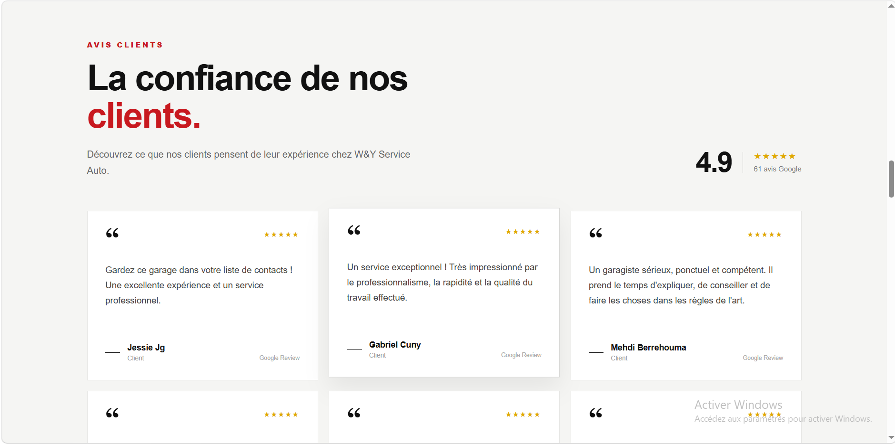
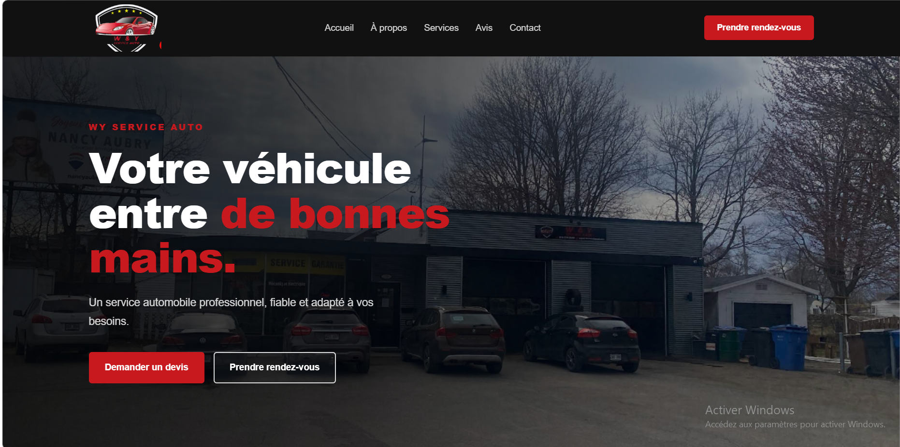
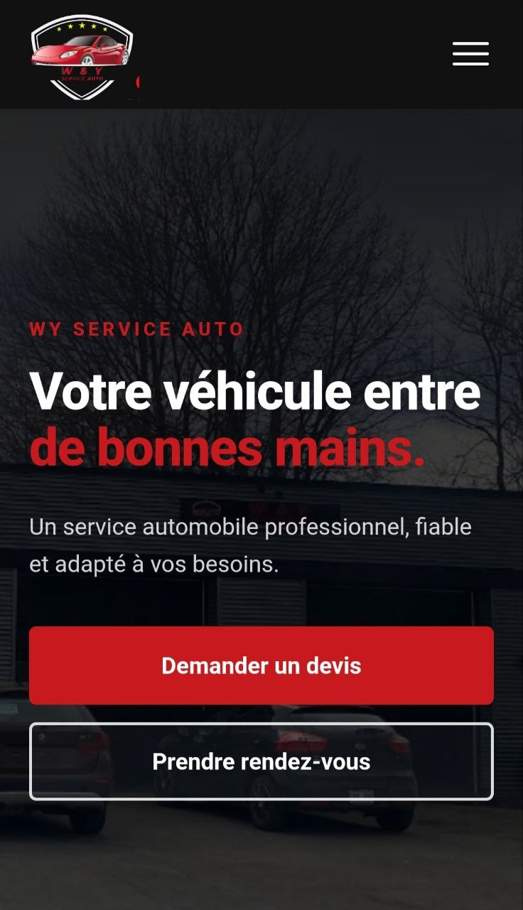

# 🚗 W&Y Service Auto

> A modern, responsive business website developed for W&Y Service Auto, an automotive service business.

**🌐 Live Website:** [wy-auto.ca] (https://wy-auto.ca/)

---

## 📸 Preview




---

## 📋 About the Project

W&Y Service Auto is a professional business website designed and developed for an automotive service company.

The website was created to give customers a clear way to discover the business, explore its services, learn about the company, view testimonials, check opening hours, and request an appointment.

This project was developed as a **real freelance client project**, from design and implementation through testing and deployment.

---

## ✨ Features

* 📱 Responsive design for desktop, tablet, and mobile
* 🧭 Responsive navigation
* 🔧 Services section
* ℹ️ About section
* ⭐ Customer testimonials
* 📅 Appointment request form
* 📩 Contact functionality
* 🕐 Business hours
* 📍 Business contact information
* 📱 Mobile-friendly user experience
* ⚡ React-based component architecture

---

## 🎨 Design & Development

The interface was first designed in **Figma** and then translated into a responsive React application.

The main design goals were:

* Clear information hierarchy
* Simple navigation
* Strong calls to action
* Professional visual presentation
* Easy access to contact and appointment information
* Responsive behavior across screen sizes

---

## 🛠️ Tech Stack

| Technology       | Purpose                                 |
| ---------------- | --------------------------------------- |
| **React 19**     | Frontend development                    |
| **Vite**         | Development server and production build |
| **JavaScript**   | Application logic                       |
| **HTML5**        | Page structure                          |
| **CSS3**         | Styling and responsive layouts          |
| **ESLint**       | Code quality and linting                |
| **Git & GitHub** | Version control                         |

---

## 🏗️ Project Structure

```text
wy-service-auto/
├── public/
├── src/
│   ├── assets/
│   ├── components/
│   ├── sections/
│   ├── App.jsx
│   └── main.jsx
├── eslint.config.js
├── index.html
├── package.json
├── vite.config.js
└── README.md
```

---

## 🚀 Development Process

The project followed a complete design-to-deployment workflow:

### 1. Requirements

Understanding the business, its services, customers, contact information, and appointment needs.

### 2. Design

Creating the website interface and visual direction in Figma.

### 3. Development

Building the interface with React and implementing reusable components and responsive layouts.

### 4. Integration

Implementing the contact and appointment functionality.

### 5. Testing

Testing the website across different screen sizes and resolving implementation issues.

### 6. Deployment

Deploying the finished website and making it available through the client's domain.

---

## 📱 Responsive Design

The website was designed to provide a consistent experience across:

* 💻 Desktop
* 📱 Mobile
* 📲 Tablet

### Desktop



### Mobile



---

## 💡 What I Learned

Working on a real client project gave me experience beyond simply implementing a design.

Through this project, I strengthened my experience with:

* React component-based development
* Responsive web development
* Translating Figma designs into code
* Form integration
* Git and GitHub workflows
* Deployment
* Debugging real-world issues
* Understanding client requirements
* Taking a project from initial requirements to a production website

---

## 🔮 Future Improvements

Possible future iterations could include:

* Online appointment management
* Automated appointment confirmations
* Customer management
* Analytics
* AI-powered customer support
* Business workflow automation
* E-commerce sell products

---

## 👩‍💻 About the Developer

**Fatima Zahra Kellal**

Master's Graduate in Networking & Information Systems
**Freelance Web Developer | AI & Automation**

I build responsive websites and I'm progressively expanding into AI automation, LLM applications, and intelligent business solutions.

---

## 📩 Let's Work Together

If you're looking for a website for your business or want to discuss a web-development project, feel free to reach out.

**🌐 Live Website:** [wy-auto.ca](https://wy-auto.ca/)

**💼 LinkedIn:** [Fatima Zahra Kellal](https://www.linkedin.com/in/fatima-zahra-kellal)

---

⭐ If you found this project interesting, feel free to explore the repository.
